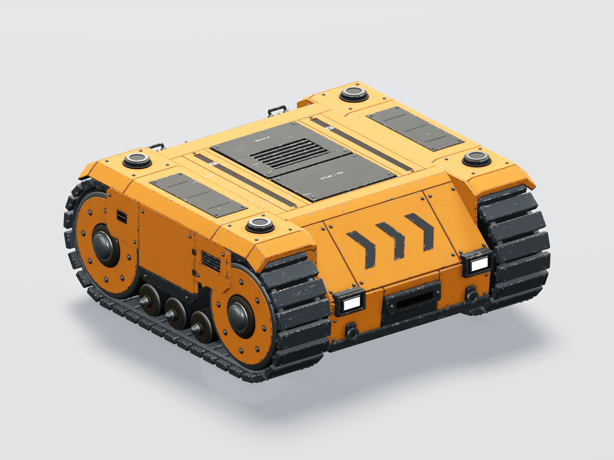

# Building convincing stylized industrial robots

For weapon parts, effects, sound and recoil feel, also read
[WEAPON_FEEL.md](WEAPON_FEEL.md).

This is the working method learned while building Atlas MX, 22–23 September
2026. The user approved the compact, cohesive V5 design on 22 September and
requested this record after the final checks. Use its construction and validation
principles for future bots; Atlas dimensions, palette and track layout are case
study values, not requirements for every robot.

The target is **stylized industrial sci-fi 3D: chunky hard-surface forms,
saturated hazard colors, weathered metal, realistic materials and clean studio
lighting**. More bolts, more polygons or a roughness slider alone do not produce
that result. The important combination is believable construction, deliberate
edge geometry, distinct material layers, coherent wear and lighting that reveals
them. Technical tests and human visual approval are separate gates.

## Visual baseline and provenance

The [reference collection](../../art_source/atlas_mx/references/README.md) preserves
the supplied concepts, the rejected V4 construction checkpoint and approved V5
native views. It distinguishes concept references from actual game captures.



Read the reference at three scales: silhouette at gameplay distance, construction
at an ordinary product-view distance, and materials/hardware in close-up. Compare
like-for-like camera angles and lighting. A dramatic arena concept is useful for
the intended material richness, but it is not evidence that a model works in the
actual game. Do not change A's production environment to make B's model look good.

The user explicitly chose to keep Atlas's compact footprint while adopting the
longer concept's cohesive armor construction. Reference proportions are not an
implicit instruction to override an agreed collision envelope or design brief.

## What the iterations taught us

1. **Initial recognizable shape was insufficient.** Corner mounts appeared to
   hover, side mount geometry did not align with its supporting plate, and shiny
   rounded blocks read as plastic. A named mount transform does not prove that
   its visible hardware has a seat.
2. **Structural alignment and matte settings helped, but did not finish the
   style.** Overlapping black plates, excessive corner overhang and near-black
   belts still differed from the reference. Visible connector bands, simpler
   slate shoes, centered sockets and genuine wheel clearance mattered more than
   adding another layer of panels.
3. **Shape and detail alone still looked like a toy.** Flat hexagons, flat wheel
   discs, uniform colored edge strips and scattered dark scratch marks lacked
   the changing reflections and material transitions of physical hardware.
4. **Physical materials and machined hardware improved the surface quality.**
   V4 added baked PBR atlases, topology-based wear, primer, explicit repaint masks,
   contact occlusion, lathed hubs and recessed button fasteners. It passed tests,
   but its many separate raised panels still failed the cohesive armor brief.
5. **The successful construction pass joined the shell.** V5 replaced floating
   layers with folded shoulders, closely fitted panels over backing structure,
   recessed rails/openings, supported skirts and joined front/rear closures.
   It retained the compact proportions and attachment contract.

For the next model, establish the coherent shell **before** the expensive final
material bake. Do not reproduce this session's costly cycle of polishing the
surface and then rebuilding the major construction underneath it.

## Start with a construction brief

Write down the footprint, ground depth, main moving envelopes, intended attachment
surfaces, material palette and the views that will prove the result. Separate
fixed constraints from reference inspiration. Preserve existing bots and loadouts
when the request is for an additional model.

Build a hierarchy: a few strong primary masses; medium-scale access plates,
folds, drivetrain and protected fittings; small fasteners, seams and wear.
Do not give every surface the same density of small details. A flat plate can
look convincing when its thickness, edge, attachment and finish are correct.

The shell must make sense in section. Trace a continuous path from roof to
shoulder, skirt, nose and rear closure. Every visible panel needs either a
continuous shell beneath it or identifiable supports. A black gap is not a
substitute for structure. Reserve open gaps for mechanisms that need to move.

## Armor and mechanical geometry

### Joined armor, narrow seams and real recesses

- Model a backing shell first. Place armor segments over it with narrow assembly
  seams, rather than leaving deep black voids between independent boxes.
- Use folded cross-sections for shoulders and the glacis. Carry their thickness
  around the corner into the side and lower apron. Use a supported rear ramp to
  meet the vertical radiator/service frame.
- Build vent openings and T-slots as actual apertures with a floor, walls and
  lips. A dark rectangle pasted onto a solid slab is not a recessed mechanism.
- Keep service covers near the surrounding surface. On Atlas the roof top is
  Y=.486 m, covers top out at .498 m, and rail floors sit .010 m below the roof.
  These are readable small steps, not stacked blocks.
- Keep bolts, hinges and latches in the same geometric coordinate system as the
  panel they fasten. Derive their seats from the panel plane/profile. Avoid
  separately eyeballing the plate, gasket, carrier and bolt positions.
- Put headlights in protective pockets with thickness and an inset lens. Seat
  recovery eyes and handle feet into the supporting metal.

On Atlas, side armor is 37 mm thick, vertical panel seams are about 6 mm, and the
front/roof seam is about 2.6 mm. These values only make sense at its authored
metre scale; choose proportions appropriate to the next model.

### Broad corner rounds and small metal chamfers are different

Separate the panel's plan-view corner radius from its thin edge chamfer. One
large bevel on every box makes armor look inflated or molded in plastic. Atlas
uses outline geometry for broad corners, then small machining chamfers, often
3–8 mm on shell details. Narrow angled faces catch light and establish thickness.

Apply bevels before weighted normals and before joining the final assembly.
Keep planar surfaces planar in their shading; smooth lathed curves while
preserving socket flats and hard transitions. Check outward caps, winding and
non-degenerate outlines. Modifier success alone does not prove a clean mesh.

### Hardware must change the reflection, not only the silhouette

Use lathed profiles for wheel dishes, rolled rims, retaining collars, rounded
axle caps and domed button heads. Atlas uses 64 radial segments for large wheels
and 40 for smaller rollers. Those values are local quality choices, not a
universal polygon budget.

Fasteners have a real recessed drive: the final two profile loops project onto
a regular six-sided socket, with flat inner walls and a lower dark floor. A
flat black hexagon and flat silver disc did not produce the same physical read.
Washers sit against the armor; fastener crowns rise out of the seat. Give the
head, washer and recess distinct material behavior without giant black outlines.

### Supports and mounts need contact, not just correct coordinates

Center corner sockets over the actual flat corner armor, not the total hood
outline or the center of an old bounding box. Build the seat beneath them.
Avoid decorative black corner overplates when the socket already has a proper
seat. Shorten end guards so curved tread runs remain visible.

For side skirts, show or model the frame brackets that connect them to the body.
Route brackets through the gap between the upper and lower rollers. Keep wide
backbones and swingarms inboard of rotating tires; use small axles through the
centers to bridge the distance.

Check optional addons too. V5 added top-rack feet, moved side-addon seats onto
solid skirt regions and connected the front impact beam to the folded apron.
A technically valid attachment transform can still leave an addon floating.

**Sloping support lesson:** do not place an axis-aligned box under a descending
panel without checking its far top corner. Two rear knees protruded through V5's
armor in the first full rear render. They became wedges following the backing
plane. For a unit plane normal with vertical component `n.y`, an inward normal
offset `d` changes the plane's height at fixed Z by `d / n.y`, not simply `d`.

## Tracks and moving clearance

The accepted track is a single slate-grey shoe, visible hinge pins/rivets and two
connecting straps through each inter-shoe gap. Extra stacked black pads obscured
the mechanism and looked unlike the reference. Keep the bands physically present
and animate them with their own half-pitch phase; painting them onto the shoe is
insufficient around the curved ends.

Atlas uses 40 shoes and 40 connector frames per side on one shared capsule path:
radius .44 m, straight half-length .76 m, center Y=-.08 m, X=±.94 m. Both the
generator and runtime consume this same contract. Wheel radii are .388/.120/.105 m
for the main/lower/return wheels. Keep pivots and local frames correct when
joining meshes; rotate the hierarchy rather than deforming the belt outline.
Animate the empty pivots only, not both pivots and similarly named child meshes;
that caused double rotation. Preserve canonical weapon frames and apply the shared
runtime scale once. Publish measured collision and ground bounds to shared spawn
consumers without changing existing walker clearance.

Do not copy one damaged texture onto every adjacent shoe. The repetition was
obvious in the V5 preview. The final asset uses eight shared mesh/UV variants,
ten instances each, with phase-offset selection on the opposite side. This
breaks adjacent wear repetition while retaining substantial geometry reuse.
It is a finite repeating set, not 80 unique hand-painted links.

Inspect clearance in motion. A clean hero still missed upper-end shoe contacts
under the sloped hoods. The final check covers rest plus seven fractional-pitch
offsets. Raising the terminal hood underside resolved the contacts without
enlarging the footprint. Shortening the outer hinge-pin ends by 3 mm provides
3.5 mm lateral clearance to the skirts.

Use a declared collision-check scope and narrow exclusions. The final audit
checks 6,454 mesh pairs across eight sampled belt positions, retains only 388
intentional central-axle triangle contacts, and allows no shoe/armor exclusions.
It is a sampled surface-intersection check, not proof of continuous clearance,
volumetric containment, optional-addon clearance or gameplay correctness.

## Materials: enamel, exposed metal and accumulated wear

### Start with actual material classes

Painted steel has a mostly dielectric enamel surface over metal. Making every
painted panel strongly metallic produces the wrong response. Conversely,
making everything dark and rough removes readable metal reflections.

Atlas's starting values, before baked variation and lighting:

- Primary enamel: sRGB (.86,.51,.055), metallic .08, roughness .66.
- Secondary enamel: sRGB (.205,.225,.235), metallic .08, roughness .61.
- Slate shoes: sRGB (.33,.355,.375), metallic .62, roughness .64.
- Connector bands: sRGB (.40,.425,.445), metallic .72, roughness .58.
- Machined metal: sRGB (.52,.55,.56), metallic .92, roughness .36.
- Oxidized metal: sRGB (.34,.315,.27), metallic .80, roughness .57.
- Rubber: sRGB (.045,.055,.06), metallic 0, roughness .84.

Use these as a calibrated case study. Determine the next model's palette and
finish from its brief. Hardware, oxidized dishes, rubber, enamel and recesses
must remain distinguishable under the same light.

### Wear follows construction and changes more than color

The early random dark scratch lines were insufficient. Uniform bright borders
also looked like graphic outlines. The final baker finds actual bevel seams and
sharp topology, measures world-space distance to them (up to 12 mm onto adjacent
faces for this asset), and breaks the edge mask with irregular noise.

Use a layer sequence: intact enamel, a narrow primer rim, exposed steel. Exposed
steel changes base color, metallic response, roughness and a small height offset.
Atlas's exposed enamel chips approach metallic .94 / roughness .37; primer is
nonmetallic and rougher. Add sparse directional face abrasions and broad low
amplitude color/roughness variation. Do not distribute equal scratches over
every square centimetre or use a UV island border as a physical wear edge.

Keep fine normal detail restrained. The final micro-bump uses distance .0005 m
and strength .4, with a low-amplitude micro-height. Strong coarse noise makes
metal look like rock, foam or dirty plastic. Surface detail must support the
forms, not obscure them.

Track chamfers start with the same slate finish as the shoe face. Only irregular
patches expose brighter, smoother metal. A continuous silver edge on every link
looked like a second decorative plate. Sparse broader scuffs complement this
intermittent polish.

### Contact occlusion must respect moving assemblies

Bake finite local occlusion inside each finalized mesh assembly. Atlas uses a
6 cm AO distance and 16 shader AO samples. The outer bake uses 1 sample for quick
AO / 4 for final AO, and 12 / 32 for the other quick/final passes.

Do not bake the stationary guard's shadow into an instanced moving shoe or wheel:
that shadow would repeat and travel around the belt. The baker isolates optional
modules and the lifter while baking, then restores every transform. Runtime
lighting supplies contacts between separate moving assemblies. AO supports
actual geometry; it cannot fix a visible air gap under a mounting point.

## Bake portable textures and preserve their meaning

The deliverable is an actual model with portable PBR textures, not a concept
image or Blender-only procedural graph. Use the procedural graph for authoring,
then bake it and inspect the imported result.

Atlas's final four atlas families are Primary and Hardware at 4096px, Secondary
and Track at 2048px. Each has base color, packed ORM and tangent-space normals.
The two enamel families also have coverage maps: fourteen PNGs total. UVs use
the first channel (`TEXCOORD_0`). Unwrap unique mesh representatives together per
family, then return the UVs to the actual loops; shared instances reuse them.
Production gutters are 3 pixels; the quick path adapts gutters for dense hardware.

ORM channels are R=occlusion, G=roughness, B=metallic. Export the AO hook as well
as roughness/metallic; merely writing a red channel does not wire glTF occlusion.
The baker uses the `glTF Material Output` occlusion input and retains normal scale.
Preserve authored emissive lamps and stencil materials rather than baking them
into non-emissive paint. Keep one canonical external map set for chassis and
lifter; verify all referenced files exist and avoid duplicate extracted images.

### Color management and file size are correctness issues

- Treat palette values as sRGB, convert once for linear material inputs, and use
  sRGB-tagged base maps. ORM, coverage and normals are Non-Color data.
- Save base textures without a display look baked into their pixels. Atlas uses
  Standard/None for base output and Raw for data, with no dither. Do not bake AgX
  into base color and then tone-map the same pixels again in the game.
- Inspect numeric pixel values and color-space metadata when a color looks wrong.
  Blender's AgX studio view looked peachier than the actual Godot ACES view even
  when the underlying enamel value was correct. Changing the palette to compensate
  blindly would have damaged the native result.
- The first 16-bit maps occupied 346.60 MB. Verified 8-bit conversion reduced the
  V4 maps to 61.45 MB with maximum raw encoded-channel error below .001969 versus
  the originals. Those numbers describe that checkpoint, not every future bake.
- Pack all required material images into the editable source, including coverage
  maps that have no Blender material user. Exclude Render Result/Viewer Node from
  packed-material validation. Compare packed PNG bytes with runtime files.
- Save the source with compression and configure Git LFS before large binary
  commits. Atlas's `.blend` is tracked as LFS; do not commit `.godot` or exports.

### Bake and packaging traps worth keeping

Float bake buffers saved with `Image.save()` can unexpectedly produce 16-bit PNGs.
Use an explicit 8-bit `save_render` path and controlled Standard/None or Raw view
settings. Baked sRGB buffers are already encoded: do not encode them twice.
Reloaded 8-bit and float/16-bit images can expose differently represented Blender
pixel arrays, so validate raw encoded PNG channels and known color swatches rather
than assuming array equality proves color fidelity. Load lazy image data before
changing its file path. Give otherwise unused coverage maps a fake user and verify
all fourteen packed images after reopening the source.

Packaging-only conversion need not trigger an expensive material rebake when
geometry, UVs and intended channel values are verified unchanged. Keep evidence
for that narrower transformation. Low GPU utilization alone does not prove a bake
is on the CPU: inspect Cycles device selection and OptiX configuration before
interrupting productive work.

## Recoloring must preserve the material layers

An RGB threshold cannot reliably tell primer from paint. A naive tint also
colors the exposed metal, dirt and chipped edge, destroying the layered finish.
Use an explicit enamel coverage texture and tint only covered enamel. Preserve
the imported AO texture, ORM factors, normal strength, emission and material
relevant imported material behavior (Atlas uses opaque armor). Keep Original paint as the imported material, with no
unnecessary shader replacement. Metal/rubber recolor channels need normalization
against their authored color rather than multiplying an already dark atlas twice.

Use `source_color` for color/emission samplers only, never ORM, normals or coverage.
If a required coverage map is missing, retain the authored material and report the
error rather than silently tinting the exposed metal.

The final native assembly test renders enamel, primer and steel swatches to
verify that only the intended region recolors. A dictionary of material names or
a static shader inspection would not prove this visible behavior.

## Lighting and review

Use large reflection cards/area lights, a warm key, restrained cool fill and a
rear rim. Leave enough environment reflection for metal to read. A black void,
hard isolated highlight or excessive bloom can make physically reasonable
materials look like plastic or hide construction defects.

The Blender studio is a source review. The Godot studio uses the real imported
GLB, a linear HDR softbox panorama, ACES, shadows and SSAO. Capture hero, rear,
side, top, corner-mount close-up and side-detail views. Then inspect the assembled
bot in the unmodified Foundry from front and rear and in the actual garage.
Frame from measured bounds rather than a hardcoded size assumption.

Do not approve a whole asset from one flattering angle. The V5 rear knees only
became obvious in the rear view; moving hood collisions only appeared in the
sampled audit. Check attachments, underside silhouette and ground contact as
well as paint. User approval is required when the brief makes it a gate; do not
substitute technical pass results or personal confidence for that approval.

## Reproducible workflow

1. Read this guide, the relevant references and the current A/B contracts. State
   fixed dimensions, mechanics, attachment frames and visual acceptance views.
2. Build the structural envelope and moving volumes. Establish coherent armor
   construction and seated mounts before detailed wear or final texture work.
3. Add medium details, machining edges and real hardware. Check front, rear,
   sides and top with simple materials. Check profile joins mathematically where
   a sloped surface or narrow moving clearance makes guessing unreliable.
4. Make an isolated quick bake/render and run geometry clearance. Keep quick
   outputs under ignored exports with `.gdignore`; never overwrite production
   maps with reduced-resolution previews or let Godot import a preview `.blend`.
5. Review form, material separation, repeated patterns and scale against the
   references. Fix the relevant cause, rather than compensating with lighting.
6. Freeze geometry, run the full bake/export and inspect every source view.
   If geometry changes afterward, rebuild the affected authoritative outputs;
   do not let the generator, editable source and runtime model silently diverge.
7. Keep assets stable while Godot imports. Scan logs, not just the exit code.
   This session encountered first-import `get_multiple_md5` / `f.is_null()` errors
   during dependency replacement even with zero exit status. Preserve the failed
   run and require a subsequent clean import; persistent failures are blockers.
8. Run baseline and native assembly/material tests. Check mipmaps for all maps,
   mount transforms, supported weapons/addons, tread and connector animation,
   repainting, garage framing and relevant gameplay contracts.
9. Run the final saved-source clearance/packed-image audit and native captures.
   Hash the actual source, GLBs, manifest and maps before and after capture.
   Label each report's scope and limits; do not imply that a source BVH test is a
   GLB reimport test, or that a short render sample certifies a multiplayer release.
10. Record user approval and exact evidence, commit the scoped iteration, fetch
    and rebase with the repository's required merge-preserving workflow, validate
    conflicts, then integrate/push main. Preserve unrelated working edits. Hand
    catalogue/server-affecting changes to A for the coordinated hosted release.

### Commands and implementation entry points

Run from the repository root; substitute the installed pinned executable paths.
The game project is the nested `battlebots/` directory.

```powershell
$atlasBlender = 'C:/Program Files/Blender Foundation/Blender 5.2/blender.exe'
$atlasGodot = 'C:/Users/jorge/Downloads/Godot_v4.7.2-stable_win64.exe/Godot_v4.7.2-stable_win64_console.exe'

& $atlasBlender --background --python tools/build-atlas.py -- --quick
& $atlasBlender --background battlebots/exports/atlas-source-preview/source/atlas_mx.blend --python docs/coordination/evidence/b-atlas-v5-clearance-2026-09-22.py -- --preview

& $atlasBlender --background --python tools/build-atlas.py
& $atlasBlender --background art_source/atlas_mx/atlas_mx.blend --python docs/coordination/evidence/b-atlas-v5-clearance-2026-09-22.py
& $atlasGodot --headless --path battlebots --editor --import --quit
& ./tools/check-baseline.ps1 -GodotPath $atlasGodot
& $atlasGodot --path battlebots res://tests/presentation/atlas_assembly_test.tscn
& $atlasGodot --path battlebots res://tests/presentation/atlas_showcase.tscn
```

A new generator run deliberately resets manifest approval to pending. Approval
belongs to the reviewed artifact, not every future regeneration.

Assembly and showcase need the native renderer for visible material assertions;
do not replace them with headless runs. `ATLAS_CAPTURE_DIR` can redirect captures.
The commands are Atlas-specific examples: adapt the checker names, object lists,
dimensions, sample coverage and expected contracts for a different model.

Source navigation:

- [Generator and geometry helpers](../../tools/build-atlas.py): coordinates,
  grouping, bevels, lathed hardware, animation pivots, eight tread variants, GLB
  portability, manifest, packed source and studio views.
- [Front and shoulder shell](../../tools/atlas_front_shell.py),
  [deck and rear shell](../../tools/atlas_deck_shell.py),
  [side skirts](../../tools/atlas_armor_shell.py): coherent construction examples.
- [Surface baker](../../tools/atlas_surface_bake.py): family UVs, topology masks,
  local AO, portable map channels, color management and packed coverage.
- [Runtime material/assembly consumer](../../battlebots/scripts/presentation/atlas_visual.gd)
  and [repaint shader](../../battlebots/scripts/presentation/atlas_paint.gdshader).
- [Geometry contract](../../battlebots/scripts/core/atlas_geometry.gd),
  [native assembly test](../../battlebots/tests/presentation/atlas_assembly_test.gd)
  and [native showcase](../../battlebots/tests/presentation/atlas_showcase.gd).
- [Final clearance evidence](../coordination/evidence/b-atlas-v5-clearance-2026-09-22.json)
  and [final native evidence](../coordination/evidence/b-atlas-native-v5-final-2026-09-23.json).

## Adding running gear to an approved chassis

The Atlas drive configurations (#47, [record](../coordination/ATLAS_DRIVES.md))
added wheels and legs without touching the approved hull. What worked:

- **Reuse approved geometry by connectivity, not by eye.** The sponsons live in
  the drive assemblies, so the generator imports the approved GLB, groups each
  drive surface into connected components (vertices welded by position, since
  glTF splits them at seams) and deletes only components identified by their
  published positions. The trimmed parts keep their approved maps; new parts get
  their own map set.
- **Fit the new gear to the old envelope first.** Measure what the old moving
  parts occupied (shoe X span, skirt inner face, hood underside, axle bosses) and
  keep the ground contact depth. Then the collision box and spawn contract do not
  change, and existing axle bosses become honest mounting points.
- **Audit the whole motion envelope a joint can reach, not a pretty gait.** Leg
  clearance was clean over a normal stride but failed at WalkerDrive's reach and
  step limits. Diagnostic overlap coordinates (the other part's triangle centroid)
  found culprits quickly; yaw stops and a rise limit are published data shared by
  the generator and the runtime solver.
- **Check actuator stroke before modelling rams.** A fixed-eye cylinder needs its
  shortest eye distance to hold both barrel and rod and its longest to keep gland
  overlap. Over the full envelope no hip-ram layout satisfied that, so the hip
  became a rotary drive and only the knee kept a ram. Compute eye ranges early.
- **Keep one construction for authoring and runtime.** The GLB stores the
  generator's neutral leg poses; the runtime test reproduces every transform
  from the rig data to 0.5 mm, so the two solvers cannot drift silently.

## Final measured limits and what not to claim

Atlas V5 has 159,877 base triangles, 175 visible base mesh instances and an
authored envelope from (-1.2175,-.554118,-1.234171) to
(1.2175,.545,1.234171). It has eleven mounts and retains the shared factor-three
runtime scale. These fit the existing 2.44 × 1.11 × 2.60 m source collision box.

The scoped RTX 3080 Foundry capture at 1800×1350, four bots and 4× MSAA measured
median 3.567 ms / p95 4.526 ms, 265 visible draws and about 2504 MiB engine video
memory over 120 frames. The report preserves the complete conditions, including
shadow draws. Do not call this a universal frame rate, low-end-device validation
or a network/long-soak release check. Shared geometry and LOD do not erase visible
triangle/draw costs. This asset exceeds the older provisional 20k–40k bot target;
budget future models explicitly instead of claiming that target was met.

The showcase still reports seven Texture RID leaks at fixture shutdown; native
assembly is clean. Record known warnings separately rather than labeling every
run warning-free. No hosted deployment was part of this asset validation.

The reproducible achievement is the user-approved asset, its actual portable
materials and bounded evidence. A future model still needs its own visual review,
clearance scope, runtime checks, performance assessment and acceptance.
