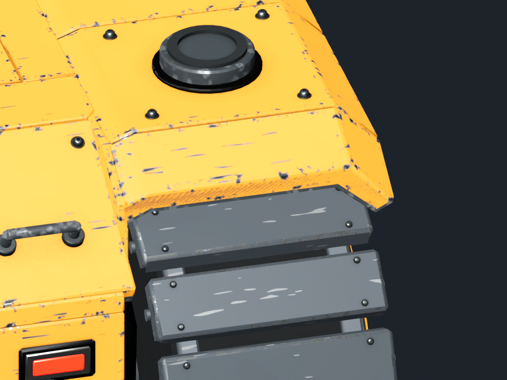

# Atlas hood edge flicker — issue #66

The rear yellow panel above the belt had diagonal flickering edge stripes.
The hood and its structural backing ended on the same Z planes (±0.891 and
±1.002 authored metres). Moving the backing 2 mm inward and 6 mm downward
had left overlapping coplanar end caps.

The backing now stops 3 mm inside each end, following the original slope.
This fixes front and rear on both sides, including the sponsons used by the
alternative drives. The external hood, track geometry, materials, UVs, indices,
mounts and physics remain unchanged. Backing vertex normals and accessor bounds
are updated with its positions. No compatibility version changes.

`tools/atlas_front_shell.py` authors the separation for future generation.
`tools/atlas_hood_seats.py` audits the saved GLBs and Blender source and provides
a guarded one-time migration for the old geometry. The approved baked assets
were migrated without rebaking; compressing the backing's existing end bevels
preserves its UVs. The matching Blender source retains all 14 packed maps.

## Native reproduction

Godot 4.7.2, Forward+, RTX 3080, 1280×960, 4× MSAA. The same fixture captures
24 successive camera positions while advancing the belt. These are matching
frame 10 captures with the original painted materials.

| Before | After |
| --- | --- |
|  |  |

```sh
ATLAS_PANEL_CAPTURE=/tmp/atlas-hood-review godot --path battlebots --script res://tests/presentation/atlas_hood_review.gd
python3 tools/atlas_hood_seats.py
blender --background art_source/atlas_mx/atlas_mx.blend --python tools/atlas_hood_seats.py -- --source
blender --background art_source/atlas_mx/atlas_mx.blend --python docs/coordination/evidence/b-atlas-v5-clearance-2026-09-22.py -- --report /tmp/atlas-hood-clearance.json
```

## Validation

- Original assets fail the cap audit with effectively zero gap; fixed source
  and exports pass with minimum 0.002999994 m (float precision).
- [Runtime buffer audit](evidence/atlas-hood-flicker/runtime-audit.json): only
  target position/normal buffers and their accessor bounds changed. Other
  metadata, indices, UVs and material references remain identical.
- [Saved-source clearance](evidence/atlas-hood-flicker/clearance.json): 6,454
  checked pairs over eight belt phases, zero unexpected contacts, 388 existing
  central-axle exclusions, unchanged footprint and eight tread mesh/UV variants.
  This is a discrete surface-intersection check, not continuous-motion proof.
- Native capture and Atlas assembly test pass; headless Atlas drives pass.
- Baseline passes, including menu flow and the stale-controller-cache startup
  regression. No claim of full-suite or online-play acceptance from these checks.

Containing build/release status is tracked on
[issue #66](https://github.com/fumbleforce/battlebots/issues/66).
